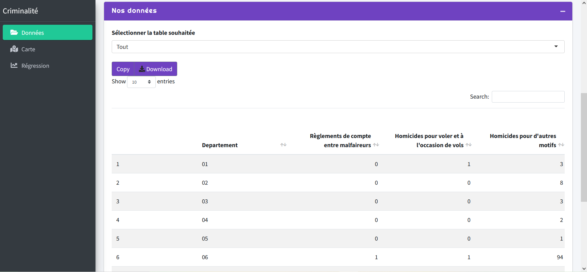
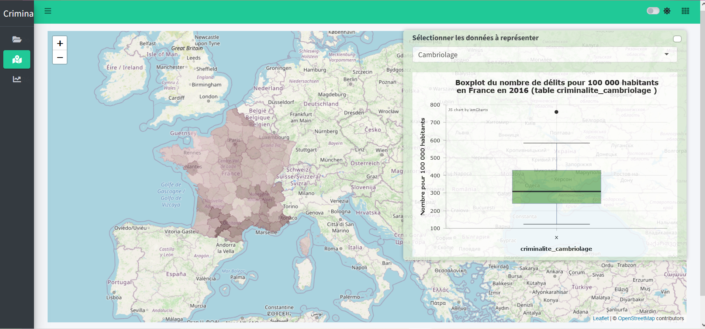
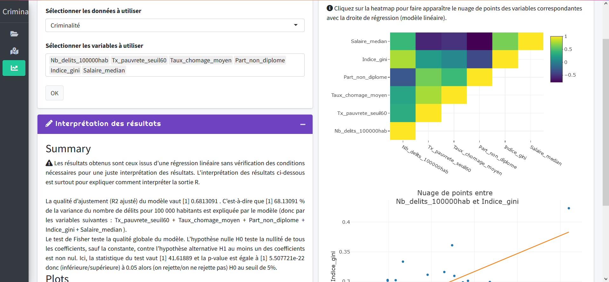

<style>body {text-align: justify}</style>

```{r setup, include=FALSE}
knitr::opts_chunk$set(echo = TRUE, eval = TRUE, warning = FALSE, message = FALSE, include = FALSE)
knitr::include_graphics(path=c("www/table_donnees.png", "www/carte.png", "www/regression.png"))
```

**Nota Bene** : Ce rapport présente l'application Shiny (disponible [ici](https://ameliegtrd.shinyapps.io/criminalite/)). Le code Github correspondant est disponible [à cette adresse](https://github.com/ameliegtrd/m1_visualisation_projet). Si vous souhaitez l'exécuter, plusieurs packages sont nécessaires pour faire fonctionner l'application. Par conséquent, le chargement peut prendre un peu de temps mais une fois que tous les packages sont installés l'application fonctionne. Elle a été testée sur différents ordinateurs, notamment ceux de l'Université.  

# 1. Présentation du sujet 

L’objectif de cette application est de présenter à l‘utilisateur une interface qui lui permette d’identifier et d’analyser le taux de criminalité en France métropolitaine en 2016. 

Un modèle de données de panel a été estimé en utilisant les données des départements français. Pour construire notre modèle, nous avons considéré plusieurs facteurs sociaux qui pourraient contribuer à l’évolution du phénomène.

L’analyse se concentre sur les déterminants de tous les délits recensés en France métropolitaine en 2016. Prenons la définition de la criminalité donnée par l’INSEE : *"les crimes et délits constatés en France sont des faits bruts portés pour la première fois à la connaissance des services de police et de gendarmerie. Sont exclus des statistiques de la criminalité constatée, l'ensemble des contraventions ainsi que les délits relatifs à la circulation routière, les actes de police administrative et les infractions relevées par d'autres administrations (douanes, services fiscaux et répression des fraudes, inspection du travail...)"*.

# 2. Présentation des données

## 2.1 Importation des données

Dans un premier temps, nous avons importé les différentes bases de données sur le site de l'INSEE (délits, diplôme, pauvreté, population, revenu médian Gini et taux de chômage).  Nous avons regroupé les bases concernant le diplôme, la pauvreté, la population, le revenu médian Gini et le taux de chômage dans un seul fichier excel *"donnees.xlsx"* (chacune dans une feuille différente). Ensuite, nous avons effectué un certain nombre de traitements présentés ci-dessous afin d'obtenir les bases qui sont proposées sur le site et stockées dans le fichier RData *"donnees_criminalite.RData"*. Vous pouvez accéder au traitement des données via le fichier *"traitements_donnees.Rmd"* disponible sur Github.    

La base principale porte sur les délits en France en 2016. Nous avons supprimé les lignes vides intitulées « index non utilisés ». Ensuite, nous avons attribué comme nom de ligne, le nom des différents délits. Puis, nous avons transposé la base car nous souhaitions avoir les délits en colonne et nous avons ajouté une colonne comprenant les 96 départements de France métropolitaine. Suite à cela, nous avons importé les bases contenant les différents indicateurs. Les bases incluant les données sur la population, le taux de pauvreté et l’indice de Gini ont été importées facilement. Nous avons seulement dû renommer la variable département pour que les jointures se fassent naturellement. En revanche, nous avons dû modifier la base diplôme en regroupant certaines colonnes. Les variables représentant le niveau de diplôme étaient ordonnées par sexe et par tranche d’âge, nous avons donc regroupé les colonnes par type car nous nous intéressons à la population générale. De plus, les données étant triées par commune, nous avons effectué un nouveau regroupement pour les avoir par département. Enfin, nous avons ajouté la population totale pour chaque département afin de calculer la part de personnes diplômées et la part de personnes non-diplômées. Pour finir, la base sur le taux de chômage contenait des données allant de 1982 à 2019, nous avons seulement conservé les données de 2016. Les données étant présentées par trimestre, nous avons décidé d’en faire la moyenne pour avoir un taux de chômage annuel moyen pour chaque département.  

Dans un second temps, nous avons vérifié qu’il n’y avait pas de données manquantes ou aberrantes. Une fois la révision faite, nous avons pu créer différentes bases. Il existe différents groupes de délits tels que les homicides, les violences sexuelles, les coups et blessures volontaires, les vols avec armes, etc.

Ensuite, nous avons ajouté les marges sur la base complète : une ligne avec le nombre total de chaque délit ainsi qu’une colonne avec le nombre total de délits pour chaque département.

Dans un dernier temps, nous avons fait la jointure des bases. Nous avons joint la base aux données concernant la population, la pauvreté, le diplôme, l’indice de Gini et le taux de chômage pour chaque département.

## 2.2 Dictionnaire des données

Voici le dictionnaire des données qui fait référence au vocabulaire commun de l’organisation de notre base.

Champs  | Correspondance | Occurences | Type de données |
------------- | ------------- | ------------- | ------------- |
Département  | Numéro de département (France métropolitaine) |{0, ...2A,2B, ..., 95} | Qualitative |
Total_delits | Nombre de délits violents par département en 2016 | {530, ..., 57 902} | Quantitative discrète |
Salaire_median | Salaire médian par département en 2016 | {22 272, ...} | Quantitative continue |
Tx_pauvrete_seuil60 | Taux de pauvreté au seuil de 60% (en%) par département en 2016 |{10.7, 18.9, ...} | Quantitative continue |
Taux_chomage_moyen | Taux de chômage (en%) par département en 2016 | {7.35, 13.7, ...} | Quantitative continue |
Part_non_diplome | Part des non ou peu diplômés dans la population non scolarisée de 15 ans ou plus par département en 2016 |{29.2, 38.9, ...} | Quantitative continue  |
Indice_gini | Indice de Gini (en %), mesure du niveau d’inégalité de la répartition du revenu médian pour la population de chaque département en 2016 | {0.302, 0.262, ...} | Quantitative continue |
Population | Nombre d’habitants par département en 2016 | {655 171, ...} | Quantitative discrète |
Nb_delits_100000hab | Nombre de délits violents pour 100 000 habitants par département en 2016 | {3936.744, ...} | Quantitative discrète |

# 3. L'application Shiny

## 3.1 Présentation de l'application

L'application Shiny est une application dynamique et intéractive. L'utilisateur a la possibilité de choisir le thème de celle-ci (clair ou sombre). Il peut aussi choisir la couleur de la barre de navigation, de la barre latérale et des accents. Pour faire son analyse, il a aussi le choix entre 4 bases de données (expliquées dans la partie "Présentation des données" de l'application) : base totale, base Criminalité, base Cambriolage et base Homicide.

Notre application comporte 3 parties.

### 3.1.1 Données  
Cette section présente dans un premier temps les différentes bases de données puis dans un second temps affiche la table de donnnées que l'utilisateur aura sélectionnée. Il est également possible d'extraire la table sélectionnée au format csv ou alors de la copier.     




### 3.1.2 Carte  
Cette section représente le nombre de délits en France en 2016 par département sur une carte. L'utilisateur a le choix de la base de données (donc du type de criminalité) qu'il souhaite représenter. Il est possible d'obtenir la population du département ainsi que le nombdre délits pour 100 000 habitants en cliquant sur le département souhaité.  
Aussi, est représenté le boxplot du nombre de délits correspondant à la table choisie pour tous les départements français.  



### 3.1.3 Régression  
Cette section comporte 3 boxes.  
La première, intutilée *"Choix de la régression"* permet à l'utilisateur de choisir la table de données ainsi que les variables qu'il souhaite intégrer dans son modèle linéaire afin d'établir la régression associée.  
Le modèle prendra comme variable à expliquer Y le nombre de délits pour 100 000 habitants. Les variables explicatives au choix sont le taux de pauvreté au seuil de 60%, le taux de chômage moyen, la part de non diplômé, l'indice de Gini ainsi que le salaire médian.  
Attention toutefois, le salaire médian diffère en fonction du département (ex : la vie coûte plus cher à Paris donc les salaires sont plus élevés) alors que l'indice de Gini mesure l'inégalité des revenus.  
Pour valider son choix, l'utilisateur appuie sur le bouton "OK". Une fenêtre pop-up apparaît ensuite pour l'avertir d'être prudent à l'égard des résultats issus de la régression linéaire. 
En effet, nous avons appliqué une régression avec ajustement des Moindres Carrés Ordinaires (MCO) sans vérification des conditions nécessaires. Ainsi, nous supposons que la distribution suit une loi normale, que le modèle est bien spécifié et qu'il n'y pas de problème d'autocorrélation d'ordre 1 des aléas ni de problème d'hétéroscédasticité.  

Pour rappel, un modèle linéaire est défini par :  
*On considère deux variables* \(X\) *et * \(Y\) *et l'on dispose d'observations* ( \( x_i, Y_i \) ), \(i = 1, ..., n\). *Ecriture analytique : *   
$$ Y_i = \beta_0 + \beta_1 \cdot x_i + \epsilon_i ,  \forall i =1,...,n $$ 
*Hypothèses :*  
- *Centrage : * \( \mathbb{E}[\epsilon_i] = 0 \),  
- *Homoscédasticité : * \(  \mathbb{V}[\epsilon_i] = \sigma^2, \forall i \),  
- *Décorrélation : * \( Cov(\epsilon_i, \epsilon_j) = 0, \forall i \neq j \)  

La seconde box intitulée *"Interprétation des résultats"* guide l'utilisateur quant à l'interprétation des résultats obtenus.  
Pour ce faire, nous avons rédigé des phrases types permettant d'interpréter le R², la statistique de Fisher et sa p-valeur associée. Les valeurs s'ajustent en fonction des résultats du summary obtenus par le modèle choisi.  

Enfin, la troisième box *"Résultats"* affiche dans l'onglet "Summary" la sortie R associée au modèle de régression linéaire choisi. Dans l'onglet *"Plots"* est représentée la Heatmap affichant la matrice de corrélation pour les variables sélectionnées par l'utilisateur. En cliquant sur l'une de ses cases, le nuage de point des variables correspondantes ainsi que la droite de régression du modèle linéaire apparaissent en dessous.  



## 3.2 Développement de l'application  
Nous avons basé notre application sur le package "bs4Dash" qui utilise la version Boostrap 4 du shinydashboard par AdminLTE3 (exemple [ici](https://adminlte.io/themes/v3/index2.html)). Il y a plusieurs fonctionnalités disponibles en plus du package "shinydashboard" que nous aurions aimé utiliser. Cependant, celles-ci n'étaient pas pertinentes dans le cadre de notre problématique. Exemple [ici](https://rinterface.github.io/bs4Dash/articles/bs4Dash.html#introduction) des différences entre les packages "shinydashboard", "shinydashboardPlus" et "bs4Dash".  


# Sources  
Pour nous familiariser avec Shiny, nous nous sommes basées sur le [cours de Visualisation avec R](https://lrouviere.github.io/VISU/pres_shiny.pdf) de *Laurent Rouvière* et *Benoît Thieurmel*.  

Nous avons également consulté l'[aide en ligne](https://rstudio.github.io/shinydashboard/structure.html#background-shiny-and-html) sur le site de *Rstudio*. 

Documentation sur le package *bs4Dash* : [ici](https://cran.r-project.org/web/packages/bs4Dash/bs4Dash.pdf).  
